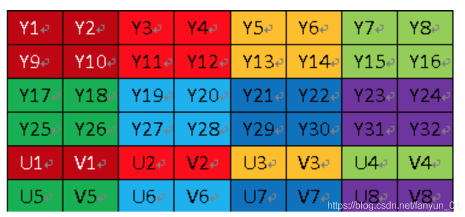
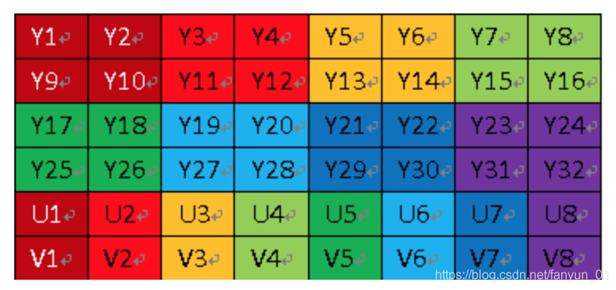

# Summary
- Video related DMEO

## YUV
#### 1 Introduction
- YUV, divided into three components, "Y" represents brightness (Luminance or Luma), which is the gray value; while "U" and "V" represent chrominance (Chrominance or Chroma), which is used to describe Image color and saturation, used to specify the color of pixels.
- Similar to the well-known RGB, YUV is also a color coding method, mainly used in TV systems and analog video fields. It separates brightness information (Y) and color information (UV). A complete image can be displayed without UV information. , it’s just black and white. This design solves the compatibility problem between color TVs and black and white TVs. Moreover, YUV does not require three independent video signals to be transmitted at the same time like RGB, so YUV transmission takes up very little bandwidth.
#### 2. YUV storage format
- The storage format of YUV code stream is actually closely related to its sampling method. There are three mainstream sampling methods, YUV4:4:4, YUV4:2:2, YUV4:2:0. For its detailed principles, you can read other articles on the Internet. Understand, what I want to emphasize here is how to restore the YUV value of each pixel from the code stream according to its sampling format, because only when the YUV value of each pixel is correctly restored, it can be extracted through the YUV and RGB conversion formula Get the RGB value of each pixel and then display it.
- Remember the following paragraph first, which will be used later to extract the YUV component of each pixel.
1. YUV 4:4:4 sampling, each Y corresponds to a set of UV components 8+8+8 = 24bits, 3 bytes.
2. YUV 4:2:2 sampling, every two Ys share a set of UV components, and one YUV occupies 8+4+4 = 16bits 2 bytes.
3. YUV 4:2:0 sampling, every four Ys share a set of UV components, and one YUV occupies 8+2+2 = 12bits 1.5 bytes.
#### 3. YUV420 type
- **Differences between 3.1, YUV420p and YUV420sp**
- Because YUV420 is more commonly used, we will focus on YUV420 here. YUV420 is divided into two types: **YUV420p** and **YUV420sp**.
- The YUV420sp format is as shown below:

- The YUV420p format is as shown below:


- **3.2, YUV420p and YUV420sp specific classification and details**
```
YUV420p: Also called planner plane mode, Y, U, and V are in different planes, that is, there are three planes.

YUV420p is further divided into: The only difference between them is the order in which UVs are stored.

I420: Also called YU12, Android mode. The storage order is to store Y first, then U, and finally V. YYYYUUUVVV

YV12: The storage order is to store Y first, then V, and finally U. YYYVVVUUU

YUV420sp: Also called bi-planer or two-planer, Y is a plane and UV is stored crosswise on the same plane.

YUV420sp is further divided into: The only difference between them is the order in which UVs are stored.

NV12: IOS only has this mode. The storage order is to store Y first, then UV alternately. YYYYUVUVUV

NV21: Android mode. The storage order is to store Y first, then U, and then VU alternately. YYYYVUVUVU
```
- **3.3, YUV420 memory calculation**

1. width * height =Y (sum)
2. U = Y / 4 V = Y / 4
3. So the length of YUV420 data in memory is width * hight * 3 / 2 (that is, one YUV is 1.5 bytes), so calculate the size of the collected data: width * hight * 1.5*frame*time
4. Take the 720×488 size image YUV420 planar as an example
```
Its storage format is: The total size is 720×480×3 × 1.5 bytes,

Divided into three parts: Y, U and V

Y component: (720×480) bytes

U(Cb) component: (720×480 × 1/4) bytes

V(Cr) component: (720×480 × 1/4) bytes

The three parts are all row-first stored, and the three parts are stored in Y, U, V order.

That is, 0--720×480 bytes of YUV data are the Y component values.

720×480--720×480×5/4 bytes is the U component

720×480×5/4 - 720×480×3/2 bytes are the V component.

Generally speaking, the directly collected video data is in RGB24 format. The size of one frame of RGB24 is size=width×heigth×3 Bit. The size of RGB32 is=width×heigth×4. The data amount of YUV standard format is 4:2:0. It is size=width×heigth×1.5 Bit.

After collecting RGB24 data, the data in this format needs to be compressed for the first time. The color space of the image is determined by RGB2YUV. Because X264 requires standard YUV (4:2:0) when encoding.

After the first data compression, RGB24->YUV (I420). In this way, the amount of data will be reduced by half, and after X264 encoding, the amount of data will be greatly reduced. Pack the encoded data and transmit it in real time through RTP. After arriving at the destination, the data is taken out and decoded. After decoding is completed, the data is still in YUV format, so it needs another conversion, which is YUV2RGB24.
```
- For details, please see the diagram illustrating the differences between YU12, I420, YV12, NV12, NV21, YUV420P, YUV420SP, YUV422P, and YUV444P_handy Zhou-CSDN Blog [https://blog.csdn.net/byhook/article/details/84037338]( https ://blog.csdn.net/byhook/article/details/84037338)

- Produce yuv pictures
```shell
ffmpeg -i 1920_1080.jpg -s 1920x1080 -pix_fmt nv12 YUV420SP_1920_1080_NV12_img.yuv
```

## ssd2x2_yuv_play_test1
- Display yuv pictures to panel
-Support 1280*720 or less
- 212 YUV420 only supports SP, NV12 (E_MI_SYS_PIXEL_FRAME_YUV_SEMIPLANAR_420) or NV21 (E_MI_SYS_PIXEL_FRAME_YUV_SEMIPLANAR_420_NV21)
- Original yuv picture shows DMEO
```
./YuvToPanel yuv_filename dispinwidth dispinheight dispoutwidth dispoutheight
eg:./ssd2x2_yuv_play_test1 ./res/YUV420SP_1024_600_img.yuv 1024 600 1024 600
```

## ssd2x2_yuv_play_test1
- Display yuv video, output 800*480 to panel by default
-Support 1280*720 or less
- 212 YUV420 only supports SP, NV12 (E_MI_SYS_PIXEL_FRAME_YUV_SEMIPLANAR_420) or NV21 (E_MI_SYS_PIXEL_FRAME_YUV_SEMIPLANAR_420_NV21)
- Original yuv picture shows DMEO
```
./ssd2x2_yuv_play_test2 yuv_filename dispinwidth dispinheight
eg:./ssd2x2_yuv_play_test2 res/YUV420SP_1280_720_NV12_video.yuv 1280 720
```


## ssd20x_h264_play_test1
- Original factory demo, the default is the public screen, which can play h264/h265 videos
```
eg: ./ssd20x_h264_play_test1 res/720P25.h264 h264 1280 720 5 1024 600
```

## ssd20x_h264_play_test2
- Simplified ssd20x_h264_play_test1 DEMO.
- The input video must be h264 1280x720, the default output is 1024x600
- Can understand the relationship between VDEC and DISP
```
eg: ./ssd20x_h264_play_test2 res/720P25.h264
```

## ssd20x_player_app
- Cross-process video playback (just a simple playback, you can add other functions if you need them)
- Kua process playback bin: https://gitee.com/mFlying/UuidSSDPlayer/tree/master/myplayer
- After compiling myplayer, copy the relevant lib to the board and run it to play the video
```
eg: export LD_LIBRARY_PATH=$LD_LIBRARY_PATH:./res/ssd20x_player_bin/lib/
eg: ./ssd20x_player_app ./res/ssd20x_player_bin/MyPlayer ./res/ssd20x_player_bin/test.mp4 1024 600
# ./res/MyPlayer is the player process. You need to compile it yourself and copy the dependent libraries before it can run.
```
