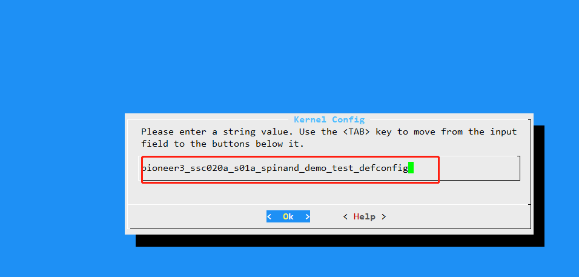

# background
- SSD2x2 architecture, when the project is packaged, the kernel will be automatically compiled and the compiled kernel will be copied to the project.
- At this time, if you modify the kernel's config in the SSD20x way (execute make menuconfig under the kernel), the kernel's configuration will be set to default when packaging the project.
- At this time, you need to save your own config.
# The operation method is as follows
### Operate in the kernel folder
1. Execute `make menuconfig` under the kernel and modify the configuration you want.
2. After the modification is completed, execute `make savedefconfig` to save your configuration.
3. Copy the saved configuration to the specified path such as `mv defconfig ./arch/arm/configs/pioneer3_ssc020a_s01a_spinand_demo_test_defconfig` **must end with defconfig**
### project folder operations
1. `make dispcam_p3_spinand.glibc-9.1.0-s01a.64.qfn128.demo_defconfig` after executing the default configuration you want to compile (don't do this, we use NOR)
2. `make menuconfig` finds kernel->Kernel Config and changes it to the configuration you just saved under the kernel.

3. After saving and exiting, execute `make image` normally.
